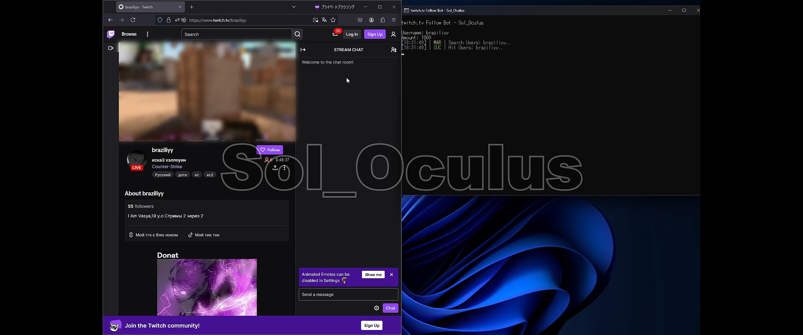

# twitch followbot
Twitch.tv's followbot repository.

Increase your Twitch following.

It is written in python and can increase the follow of a given user.

This project is planned to be open source.
If you would like the source code, please come to the discord below.
Please note that with open source code, you will be following along via our API.
If you want to follow the original API instead of via our API, please purchase the source code separately.

If you need the source code, we sell it, please contact us.

Discord｜sol_oculus

[discord invitation](https://discord.gg/gUGmD77t4A)

# Preview

# Video

[YouTube](https://www.youtube.com/watch?v=L7A7YsRgugY)

# 2025/3/24
